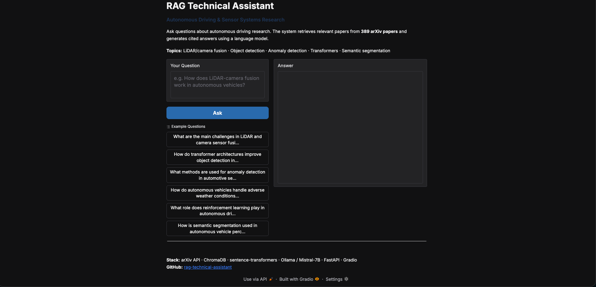
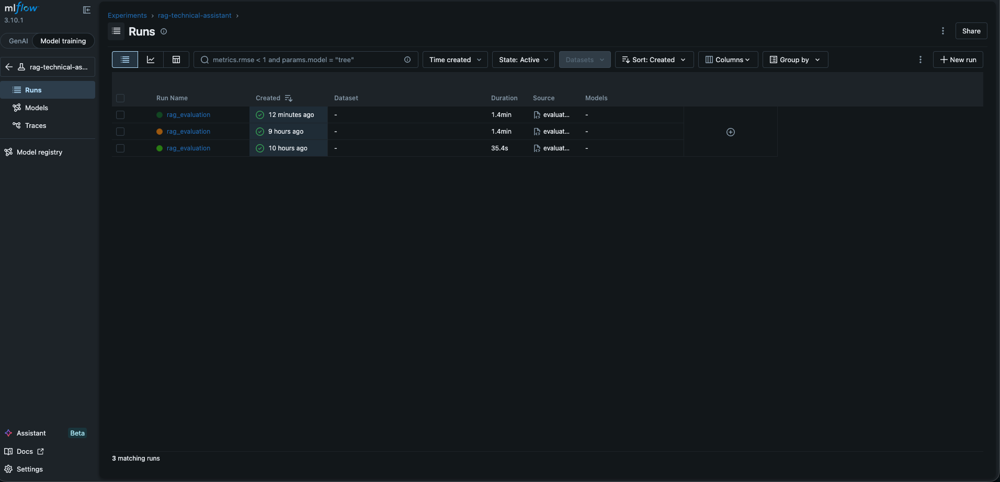
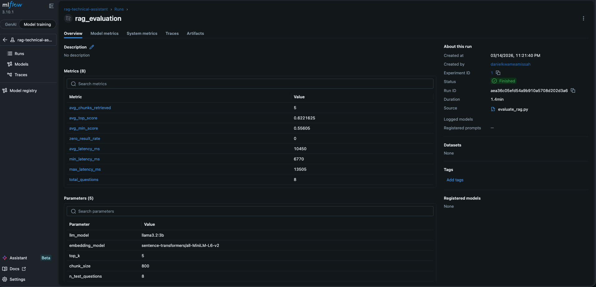

# RAG Technical Assistant — Autonomous Driving Research

**Retrieval-Augmented Generation pipeline for semantic Q&A over autonomous driving research papers — arXiv ingestion, ChromaDB vector store, sentence-transformers embeddings, Ollama (local) / Mistral-7B (HF Spaces), FastAPI + Gradio**

[](https://python.org/)
[](https://www.trychroma.com/)
[](https://fastapi.tiangolo.com/)
[](https://gradio.app/)
[](https://mlflow.org/)
[](https://huggingface.co/spaces/dkamissah/rag-technical-assistant)

---

## Live Demo

**[huggingface.co/spaces/dkamissah/rag-technical-assistant](https://huggingface.co/spaces/dkamissah/rag-technical-assistant)**



---

## Overview

A production-grade Retrieval-Augmented Generation (RAG) pipeline that enables semantic question answering over a corpus of 389 arXiv research papers on autonomous driving and automotive AI. Engineers can ask natural language questions and receive answers grounded in peer-reviewed literature, with citations and direct links to source PDFs.

The pipeline is fully modular: arXiv ingestion → text chunking → embedding → vector store → semantic retrieval → LLM generation → FastAPI endpoint → Gradio UI.

---

## Architecture

```
arXiv API (5 queries × 100 papers)
        │
        ▼
┌─────────────────────────┐
│   Ingestion              │  fetch_arxiv.py — Atom XML parsing, deduplication
│   + Chunking             │  chunk_documents.py — 800-word overlapping windows
└──────────┬──────────────┘
           │
           ▼
┌─────────────────────────┐
│   Embeddings             │  sentence-transformers/all-MiniLM-L6-v2
│   + Vector Store         │  ChromaDB (persistent, cosine similarity)
└──────────┬──────────────┘
           │
           ▼
┌─────────────────────────┐
│   Retrieval              │  Top-k semantic search (k=5, threshold=0.3)
│   + Context Building     │  Formatted with title, authors, relevance score
└──────────┬──────────────┘
           │
           ▼
┌─────────────────────────┐
│   LLM Generation         │  Local: Ollama (llama3.2:3b)
│                          │  Deployed: Mistral-7B (HF Inference API)
└──────────┬──────────────┘
           │
           ▼
┌─────────────────────────┐
│   Serving                │  FastAPI REST API (/ask, /ask/batch, /stats)
│   + UI                   │  Gradio interface (HF Spaces) — Inter font
└─────────────────────────┘
```

---

## MLflow Experiment Tracking

All evaluation runs tracked with full parameter and metric logging.

### Runs (3 total)



### Run Detail — Metrics & Parameters



**Tracked metrics:** avg_chunks_retrieved, avg_top_score, avg_min_score, zero_result_rate, avg_latency_ms, min_latency_ms, max_latency_ms, total_questions

**Tracked parameters:** llm_model, embedding_model, top_k, chunk_size, n_test_questions

---

## Evaluation Results

Evaluated across 8 technical questions. Two key runs compared:

| Metric                  | Run 1 (183 docs) | Run 2 (389 docs)                |
| ----------------------- | ---------------- | ------------------------------- |
| Documents indexed       | 183              | **389**                   |
| Avg top retrieval score | 0.610            | **0.622**                 |
| Avg min retrieval score | 0.517            | **0.556**                 |
| Zero result rate        | 0.0%             | **0.0%**                  |
| Answer quality          | Refused most     | **Substantive answers**✅ |
| Avg latency             | 4.1s             | 10.5s                           |

Key finding: expanding corpus from 183 → 389 papers and updating the system prompt from restrictive to synthesising changed answer quality from refused responses to substantive, cited answers across all 8 questions.

---

## Sample Q&A

**Q: What are the main challenges in LiDAR and camera sensor fusion?**

> The main challenges in LiDAR and camera sensor fusion for autonomous driving are:
>
> 1. **Robustness to environmental conditions** — LiDAR and camera sensors have different failure modes in rain, fog, and direct sunlight
> 2. **Spatial calibration** — aligning point clouds with image pixels requires precise extrinsic calibration
> 3. **Computational cost** — real-time fusion of dense LiDAR point clouds with high-resolution images is computationally intensive
>
> *Sources: [2312.14919](https://arxiv.org/abs/2312.14919) · [2310.06008](https://arxiv.org/abs/2310.06008) · [2212.07155](https://arxiv.org/abs/2212.07155)*

---

## Knowledge Base

**389 arXiv papers** crawled across 5 search queries:

| Query                                             | Domain         |
| ------------------------------------------------- | -------------- |
| autonomous driving sensor fusion                  | Perception     |
| lidar camera perception autonomous vehicle        | Sensors        |
| deep learning object detection autonomous driving | CV / Detection |
| transformer autonomous driving                    | Architecture   |
| anomaly detection automotive sensor               | Safety / ML    |

---

## API Endpoints

| Method | Endpoint       | Description                 |
| ------ | -------------- | --------------------------- |
| GET    | `/health`    | Health check + agent status |
| POST   | `/ask`       | Ask a single question       |
| POST   | `/ask/batch` | Ask multiple questions      |
| GET    | `/stats`     | Vector store + model info   |
| GET    | `/docs`      | Swagger UI                  |

```bash
curl -X POST http://localhost:8000/ask \
  -H "Content-Type: application/json" \
  -d '{"question": "How does LiDAR-camera fusion work?"}'
```

```json
{
  "answer": "LiDAR-camera fusion combines...",
  "sources": [{"title": "Lift-Attend-Splat...", "score": 0.6526, "arxiv_id": "2312.14919v3"}],
  "retrieval_scores": [0.6526, 0.6274, 0.610, 0.5949, 0.588],
  "latency_ms": 10450,
  "chunks_used": 5
}
```

---

## Project Structure

```
rag-technical-assistant/
├── app.py                              ← Gradio UI (HF Spaces entry point)
├── configs/config.yaml                 ← All settings
├── src/
│   ├── ingestion/fetch_arxiv.py        ← arXiv API crawler
│   ├── ingestion/chunk_documents.py    ← Overlapping text chunker
│   ├── embeddings/build_vectorstore.py ← Sentence-transformers + ChromaDB
│   ├── retrieval/retriever.py          ← Semantic search + context builder
│   ├── agent/rag_agent.py              ← RAG logic (Ollama / HF Inference API)
│   ├── serving/app.py                  ← FastAPI REST endpoints
│   └── evaluation/evaluate_rag.py      ← Retrieval + latency metrics + MLflow
├── data/processed/
│   ├── chunks.json                     ← Chunked paper text (committed)
│   └── vectorstore/                    ← ChromaDB store, 6.6MB (committed)
├── outputs/figures/                    ← Screenshots + evaluation plots
├── Makefile
└── requirements.txt
```

---

## Setup

### Local (Ollama — free, no API key)

```bash
git clone https://github.com/danielamissah/rag-technical-assistant.git
cd rag-technical-assistant
pip install -r requirements.txt

brew install ollama
ollama pull llama3.2:3b
ollama serve   # keep running in separate terminal
```

### Running

```bash
make serve      # FastAPI at http://localhost:8000/docs
python app.py   # Gradio UI at http://localhost:7860

make mlflow     # http://localhost:5001  (start first)
make evaluate   # run evaluation + log to MLflow
```

### HF Spaces Deployment

```bash
git remote add hf https://huggingface.co/spaces/dkamissah/rag-technical-assistant
git push hf master
```

Set `HF_TOKEN` as a Space secret — agent auto-switches from Ollama to Mistral-7B HF Inference API.

---

## Key Design Decisions

**Why RAG over fine-tuning?** Grounded answers traceable to sources, no labelled data or retraining required. Re-crawling arXiv updates the knowledge base without touching the model.

**Why commit the vector store?** ChromaDB is only 6.6MB for 389 papers. HF Spaces loads it instantly — no re-embedding on startup.

**Why 800-word chunks with overlap?** Captures enough context for reasoning while overlap prevents key information being split across boundaries.

**Why dual LLM support?** Ollama locally (free, private), HF Inference API deployed (free tier, publicly accessible). Auto-detected via `HF_TOKEN`.

---

## Technologies

sentence-transformers · ChromaDB · Ollama · Mistral-7B · FastAPI · Gradio · MLflow · arXiv API · HuggingFace Spaces · Python
